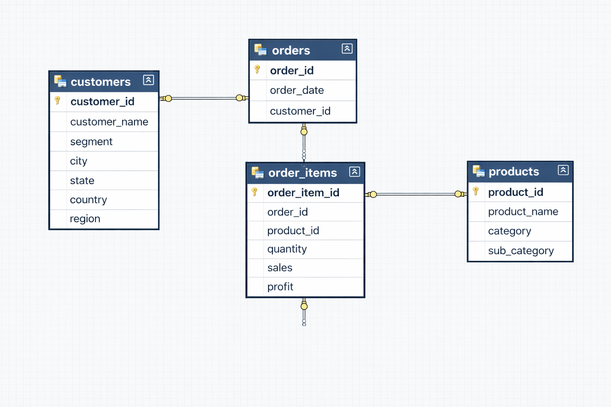

# Retail Sales Performance Analysis using SQL

## Project Overview

This project analyzes retail sales data using SQL to answer real-world business questions related to sales performance, customer behavior, and product profitability.

The objective is to demonstrate practical SQL skills commonly used by data analysts, including data modeling, querying, and insight generation.

---

## Database Schema

The database follows a normalized retail structure with four core tables:

- **Customers** – customer details and demographics  
- **Orders** – order-level information  
- **Order_Items** – product-level sales details per order  
- **Products** – product and category information  

---

## Project Structure

retail-sales-performance-analysis-sql/
│
├── schema/
│ └── schema.sql # Database schema definition
│
├── data/
│ └── sample_data.sql # Sample data for testing
│
├── queries/
│ ├── easy.sql # Basic SQL queries
│ ├── moderate.sql # Intermediate SQL queries
│ └── advanced.sql # Advanced SQL queries
│
├── insights/
│ └── insights.md # Business insights & findings
│
├── assets/
│ └── database_schema.png # Schema diagram
│
└── README.md

---

## Key Business Questions

### Easy
- How many customers and orders are there?
- What is the total revenue generated?
- Which products have the highest sales?

### Moderate
- What is the average order value?
- Which customers contribute the most revenue?
- Sales performance by category and region

### Advanced
- Which orders exceed the average order value?
- What percentage of revenue comes from the top 20% of customers?
- Customer segmentation based on purchasing behavior

---

## Skills Demonstrated

- SQL joins (INNER, LEFT)
- Aggregations and grouping
- Subqueries
- Business-focused analysis
- Database schema design

---

## Tools Used

- SQL (MySQL / PostgreSQL compatible)
- Git & GitHub

---

## How to Use This Project

1. Create the database using `schema/schema.sql`
2. Insert sample data using `data/sample_data.sql`
3. Run queries from the `queries/` folder
4. Review insights in `insights/insights.md`

---

## Author

**Aliraja Ansari**  
Aspiring Data Analyst | SQL | Data Analysis  

GitHub: https://github.com/aliraza-78
